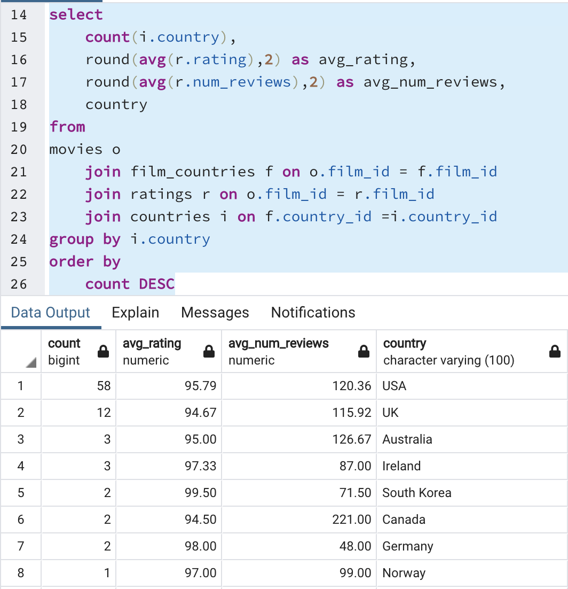

# Movie Data Pipeline

## Background
Imagine a bunch of data came in and it needs to be migrated it to a production data base.

## Technologies Used
- Python
- Jupyter Notebook
- PostgresSQL
- OMDB API

## Objective
Extract, Load, and Transform a data set to a productional database to query against.

## Data
- Top 100 Movies of 2020 from Rotten Tomatoes: https://www.rottentomatoes.com/top/

## Extract
The Rotten Tomatoes website displaying the Top 100 Movies for 2020 was scraped into a CSV. That CSV was run through the OMDB API to provide additional information about each movie. A new CSV displaying all of this data was created.

## Transform
The syntax of the data pulled from Rotten Tomatoes was cleaned first: parentheses from movie titles were removed, percent signs from the ratings, the rating columns was changed to an integer.  

Second, the additional data from the OMDB API was cleaned.  We initialized the lists of columns we wanted to add to our cleaned Rotten Tomatoes table. We then created a loop that would parse the responses and append the information to our list of columns. If information was missing from the API, we used a Try/Except to move onto the next movie. Next, columns were renamed and data was exported to a CSV. The final thing we did to our API data was to go through columns we wanted to write queries for in pgAdmin 4. The columns we chose were Genre, Language, Actor, Country, Director, and Movies. From these columns, we created queries to match our ERD diagram and used pgAdmin 4 to extract specific insights we wanted from our data.

## Load
A PostgreSQL database was created using PGAdmin to load the movie data from the Entity Relationship Diagram.

## Queries
- Top 10 Movies 2020

- Average Rating by Genre

Horror movies had the highest rating but the least number of reviews, which was an interesting insight.

- Film Count per Country

This showed us which country had the most movies shown for the top 100 2020 movies. The USA had the highest count by far.

- Count of Films by Director

Spike Lee and Hlynur Palmason each had two films in the Top 100 for 2020 by Spike Lee had the highest average rating of reviews with 94.50.

- Film Count by Actor

Elisabeth Moss and Lucas Jaye were each in two films in teh Top 100 for 2020.